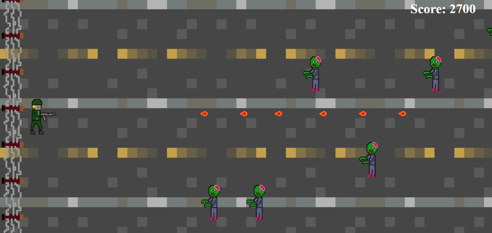
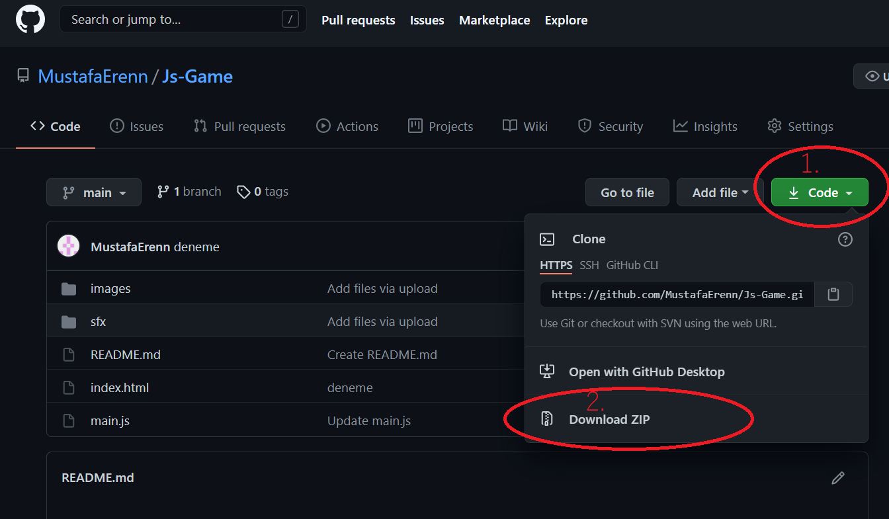

# ZomKill 🧟
# Genel Özet
## Proje Amacı
Bu proje  BTU-Web Tabanlı Programlama dersi için yaptığım sadece javascript ve html kullanarak geliştirdiğim oyundur.
## Oyunun Hikayesi
Bütün dünya zombilerin istilasında katledildi. Sen insanlığın son kalesindeki koruyucu bir askersin. Zombiler bariyerlere ulaşmadan önce onları yok et.

## Nasıl Oynanır?
`W` ve `S` tuşlarını askerini koridorlar arasında geçiş yapmak için kullan.
`Mouse Left Click` kullanarak zombilere ateş edebilirsin.

# Oyundan görüntüler

# Kullanılan Teknolojiler
- HTML
- JavaScript
- CSS

# Kurulum ve Oynanış
## Github üzerinden indirmek

Resimdeki adımları takip ederek kodu zip olarak indirdikten sonra zipi açarak dosya içindeki index.html'e çift tıklayarak açarsanız oyunu oynabilirsiniz.

## Oyun linki
Kodu indirmek istemezseniz linkten oynayabilirsiniz -> https://mustafaerenn.github.io/Js-Game/

# Tasarım
Oyun içindeki yer alan objelerin (images klasörü altındaki resimler) tamamını https://www.piskelapp.com/ adresinden online olarak çizdikten sonra oyuna entegre ettim

# Ses Efektleri ve Müzik
Ses efektlerini sfxr isimli uygulamadan seçtikten sonra indirip oyuna ekledim.
(sfxr uygulamasının websitesi ve indirme linki -> https://www.drpetter.se/project_sfxr.html)

Oyun başladıktan sonra çalan arkadaki müziği youtube üzerinden buldum ve oyuna entegre ettim.(Müziğin youtube linki -> https://www.youtube.com/watch?v=6HvFLkuFOvc)

# Lisans 
Karakter tasarımları ve kodlar @MustafaErenn tarafından yapılmıştır. 
